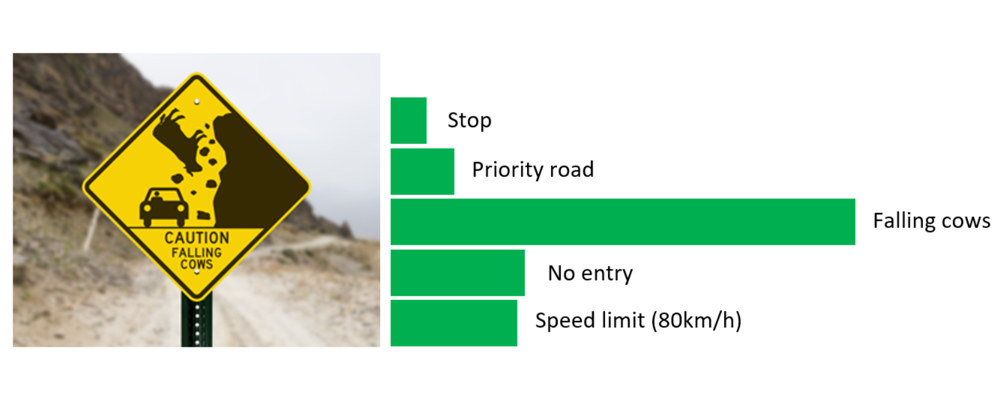

**Recognising Traffic Signs**

An important skill that a self-driving car must have is the ability to classify traffic signs. In this project it is shown how to perform traffic sign recognition by using Keras and CNNs with Python. 

**Step 1:** Getting setup with Python

For this project, you will need Python 3.5 along with the Tensorflow and Keras libraries.

It is reccomended to install the Anaconda Python 3 distribution from Continuum Analytics.

Choose the appropriate Python 3 Anaconda install package for your operating system <A HREF="https://www.continuum.io/downloads" target="_blank">here</A>.   Download and install the package.

If you already have Anaconda for Python 2 installed, you can create a separate environment for Python 3 and all the appropriate dependencies with the following command:

`>  conda create --name=yourNewEnvironment python=3.5 anaconda`

`>  source activate yourNewEnvironment`

**Step 2:** Installing Tensorflow

Once you have Anaconda installed, first double check you are in your Python 3 environment:

`>python`
`Python 3.5.2 |Anaconda 4.1.1 (x86_64)| (default, Jul  2 2016, 17:52:12)`
`[GCC 4.2.1 Compatible Apple LLVM 4.2 (clang-425.0.28)] on darwin`
`Type "help", "copyright", "credits" or "license" for more information.`
`>>>`
(Ctrl-d to exit Python)

run the following command at the terminal prompt to get Tensorflow (for Python 3.5, CPU-only):

`>  pip install --ignore-installed --upgrade https://storage.googleapis.com/tensorflow/linux/cpu/tensorflow-1.2.1-cp35-cp35m-linux_x86_64.whl`

then to test if Tensorflow is installed correctly:

`> python`
`>>> import tensorflow as tf`
`>>>`
(Ctrl-d to exit Python)

**Step 3:** Installing Keras

To install Keras run the following command in the Anaconda environment:

`>conda install -c conda-forge keras`

and check that the installation worked:

`> python`
`>>> import keras`
`>>>`
(Ctrl-d to exit Python)

**Step 4:** Download the Data Set (follow instructions in input/download_data.md)

**Step 5:** Run

Run `graphic_test_from_testset.py` in order to classify some exemplary traffic signs and see how the algorithm works.
